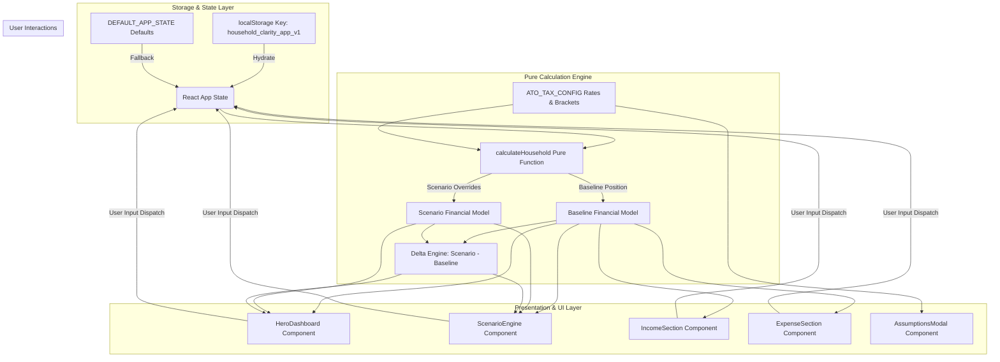

# Technical Architecture & System Design

**Project**: Household Financial Clarity (MVP)  
**Author**: Engineering Team  
**Last Updated**: 2026-07-27  

---

## 1. Architectural Overview & Design Principles

The application is engineered as a **client-side, local-first React web application** with zero backend infrastructure requirements.

### Core Principles
1. **Separation of Concerns**: Pure calculation logic (`src/logic/calculator.js`) is completely decoupled from UI components.
2. **Immutable ATO Config**: Tax brackets, thresholds, and Medicare rates are stored in `src/config/atoTaxConfig.js` rather than embedded in code.
3. **Reactive Live Recalculation**: Any user input (typing salary, changing frequency, adjusting slider) triggers a memoized recalculation (`useMemo`) in $O(N)$ time, delivering instant $<16\text{ms}$ updates.
4. **Local-First Persistence**: App state is synchronized to `localStorage` via a custom hook (`useLocalStorage.js`) with fail-safe fallback to sample defaults.

---

## 2. System Data Flow Diagram

---

## 3. Financial Calculation Engine Specifications

### 3.1 Frequency Normalisation Matrix
To sum disparate expenses and incomes accurately, all dollar amounts are converted to annual amounts first using exact multipliers, then deannualised to standard monthly figures:

$$\text{Annual Amount} = \begin{cases} \text{Amount} \times 52 & \text{if Weekly} \\ \text{Amount} \times 26 & \text{if Fortnightly} \\ \text{Amount} \times 12 & \text{if Monthly} \\ \text{Amount} \times 1 & \text{if Annual} \end{cases}$$

$$\text{Monthly Amount} = \frac{\text{Annual Amount}}{12}$$

### 3.2 ATO Resident Income Tax & Medicare Levy Algorithm
The function `calculateTaxAndLevy(taxableIncomeAnnual)` executes the piecewise tax function:

$$T(x) = \text{BaseTax}_k + (x - \text{Min}_k) \cdot \text{Rate}_k + (x \cdot 0.02)$$

where $k$ is the matching tax bracket for annual taxable income $x$.

### 3.3 Spendable Cashflow vs. Superannuation Differentiation
Superannuation ($S$) is computed as:
$$S = \text{Primary Salary} \times \text{Super Rate \%}$$
Superannuation is **strictly excluded** from usable cash income:
$$\text{Usable Cash Income} = \text{Gross Taxable Income} - T(x)$$
This ensures the couple sees true spendable liquidity while tracking long-term retirement wealth separately.

---

## 4. Scenario Engine Architecture

The Scenario Engine creates a live virtual branch of the household state without mutating the baseline position:

1. **Income Overrides**: `salary` fixed value override or `salaryPercent` scalar (e.g. $50\%$ for parental leave).
2. **Expense Overrides**: Array of scenario-specific expenses or baseline expense modifications.
3. **Delta Calculation**:
   $$\Delta \text{Net Cashflow} = \text{Scenario Net Cashflow} - \text{Baseline Net Cashflow}$$
4. **Rendering**: Displays side-by-side comparison tables with color-coded deltas ($\Delta$).

---

## 5. Performance & Security Considerations

- **Client-Side Data Privacy**: All financial data remains on the user's local device in `localStorage`. No third-party tracking or remote API calls are executed.
- **Bundle Optimization**: Built using Vite 6 + React 19, resulting in a minified production bundle size of $< 240\text{kB}$ ($71\text{kB}$ gzipped).
- **Responsive & PWA Ready**: Uses CSS grid/flexbox layouts tailored for mobile viewports ($< 480\text{px}$) and desktop monitors.
