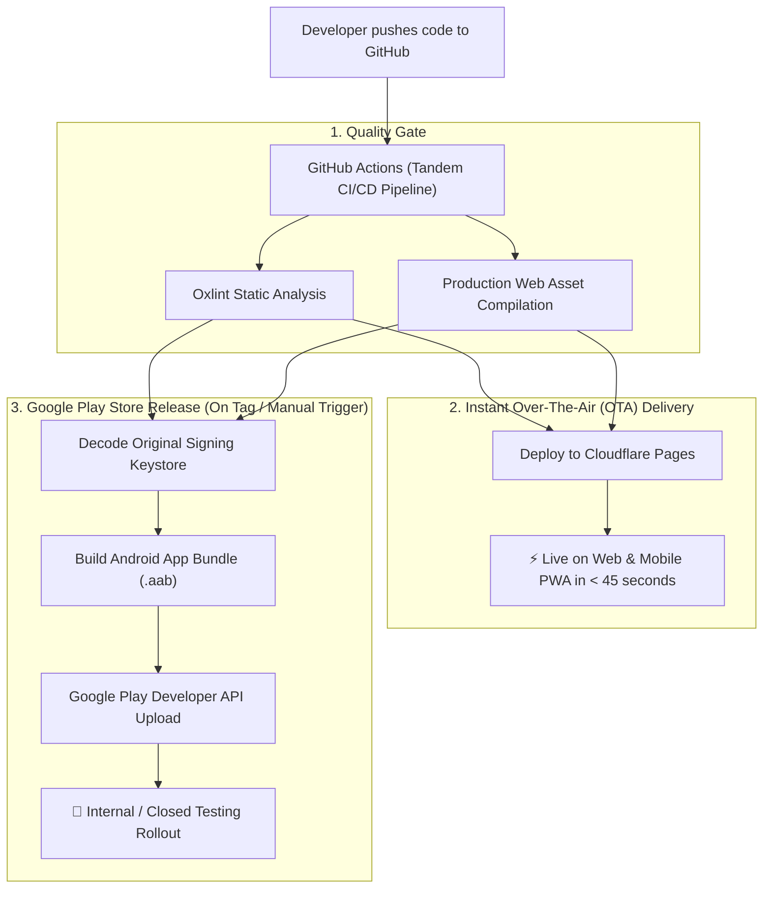

# Project Tandem — Automated CI/CD & Release Pipeline

This guide documents the automated delivery pipeline for **Project Tandem** hosted on **Cloudflare Pages** and published to **Google Play Store**.

---

## 🏗️ Pipeline Architecture



---

## ⚡ 1. Daily Feature Delivery (Instant OTA Updates)

Whenever you make code changes (React components, tax calculation algorithms, CSS styling, paywall modal copy, or new features):

```bash
git add .
git commit -m "feat(calculator): update stage 3 tax bracket calculations"
git push origin main
```

### What Happens Automatically:
1. **Lint & Test Suite**: Verifies zero lint warnings and zero errors.
2. **Web Production Bundle**: Compiles optimized production bundle (`dist/`).
3. **Cloudflare Deployment**: Pushes production build directly to [`project-tandem.pages.dev`](https://project-tandem.pages.dev).
4. **Live on Phones**: Users receive the update instantly the next time they open the app. **Zero Google Play review wait time**.

---

## 📦 2. Releasing a Native Android Update (`.aab` to Google Play)

When you need to update native properties (e.g. app launcher icon, splash screen background, or version bump in the Play Store):

### Method A: Via Git Release Tag (Automated)

```bash
# 1. Update version in package.json & src/config/version.js (e.g. 1.2.0)
# 2. Update versionCode in twa-manifest.json (e.g. 2)
git commit -am "chore(release): bump version to v1.2.0"

# 3. Create and push tag
git tag v1.2.0
git push origin v1.2.0
```

### Method B: Via GitHub Actions UI (Manual Trigger)

1. Go to **[GitHub Repository Actions](https://github.com/ibram-saleeb/project-tandem/actions/workflows/ci-cd-pipeline.yml)**.
2. Select **Tandem CI/CD Pipeline** $\rightarrow$ Click **Run workflow**.
3. Check **"Publish .aab to Google Play Internal Testing?"**.
4. Select the target track (`internal`, `alpha`, `beta`, or `production`).
5. Click **Run workflow**.

---

## 🔐 3. Required GitHub Repository Secrets

Configure these secrets in **[GitHub Secrets Settings](https://github.com/ibram-saleeb/project-tandem/settings/secrets/actions)**:

| Secret Name | Description | Source |
| :--- | :--- | :--- |
| `ANDROID_KEYSTORE_BASE64` | Base64 string of `android-release-key.keystore` (SHA1: `24:D6:68:B1...`) | Generated from project keystore |
| `CLOUDFLARE_API_TOKEN` | Cloudflare API Token with Workers/Pages Edit permission | Cloudflare Dashboard $\rightarrow$ API Tokens |
| `GOOGLE_PLAY_KEY_JSON` | Google Play Developer API Service Account JSON key | Google Play Console $\rightarrow$ API access |

---

## 📊 4. Monitoring & Logs

- **GitHub Action Workflow Runs**: [`github.com/ibram-saleeb/project-tandem/actions`](https://github.com/ibram-saleeb/project-tandem/actions)
- **Live Production App**: [`project-tandem.pages.dev`](https://project-tandem.pages.dev)
- **Google Play Internal Testing Track**: Google Play Console $\rightarrow$ Project Tandem $\rightarrow$ Testing $\rightarrow$ Internal testing
